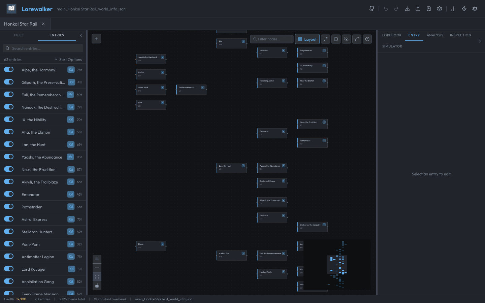

> [!WARNING]
> **This is early beta - it's probably broken**
> Analysis and simulation features are getting there but not yet fully reliable. Open issues when you find problems. Real-world use cases help more than anything.

---

# Lorewalker

Lorewalker is a local-first lorebook editor, visualizer, and analysis tool for AI roleplay platforms like SillyTavern. It transforms flat JSON lorebook files into an interactive graph-based editing experience — letting you see how your entries connect, catch structural problems, and simulate activation, all without any backend or account.

---



## Features

### Lorebook Editing

- **Import / Export** — drag-and-drop or file picker; full SillyTavern lorebook JSON round-trip, including `.png` character cards and `.charx` files; lorebook picker for character cards containing multiple lorebooks
- **Full CCv3 entry editor** — all lorebook entry fields with live token counting; double-click any graph node to edit in a full-screen modal
- **Multi-tab workspace** — open multiple lorebooks simultaneously, each with independent undo/redo (`Cmd/Ctrl+Z`, `Cmd/Ctrl+Shift+Z`)
- **Lorebook metadata editor** — global scan depth, token budget, recursion settings, insertion strategy
- **Keyboard shortcuts** — `Cmd/Ctrl+Z` undo, `Cmd/Ctrl+Shift+Z` redo, `Cmd/Ctrl+S` snapshot, `Cmd/Ctrl+N` new entry, `Escape` clear selection

### Recursion Graph

- **Interactive node graph** — directed edges show which entries keyword-trigger which others
- **Edge styles** — solid (active link), dashed (blocked by `preventRecursion`/`excludeRecursion`), red (cycle)
- **Auto-layout** (dagre), minimap, zoom, fit-to-view
- **Bidirectional selection** — click a node to select the entry in the list; click the list to highlight the node
- **Graph search** — filter by name, content, or keywords; non-matching nodes dim in place
- **Drag to create edges** — drag between nodes to add a keyword mention; delete edges to remove it
- **Simulator highlighting** — after running the simulator, nodes and edges show activation state and recursion depth
- **Context menu** — right-click the canvas to add an entry at that position

### Health Analysis

- **Real-time 0–100 health score** — recomputes as you edit, no manual trigger needed
- **32+ deterministic rules** across structure, configuration, keywords, recursion, and budget categories
- **Error / warning / suggestion severities** — findings are clickable and navigate to the affected entry
- **Custom rules** — visual condition builder for creating your own per-entry checks; per-document rule overrides
- **LLM-powered deep analysis** *(rough draft)* — BYOK qualitative review via any OpenAI-compatible endpoint or Anthropic; content quality, keyword suggestions, scope checks

### Keyword Analysis

- **Keyword table** — full cross-lorebook view of all keywords in use
- **Keyword detail pane** — per-keyword entry usage, overlap detection, and match statistics

### Activation Simulator

- **SillyTavern activation engine** — full keyword scan, selective logic, probability, sticky/cooldown/delay, priority sort, recursion, token budget
- **Multi-message replay** — build a conversation and see how activation changes message-to-message
- **Recursion trace** — step-by-step display of recursion unfolding

### Persistence

- **Autosave to IndexedDB** (2s debounce) — no manual save required for recovery
- **Named snapshots** (`Cmd/Ctrl+S`) — save a named snapshot at any point; browse and restore from the Files panel
- **Crash recovery** — on relaunch, offers to restore any unsaved sessions
- **Tab-close dirty confirmation** — warns before losing unsaved changes
- **Panel layout persistence** — sidebar widths and collapse state survive reloads

### Settings

- **14 themes**: Dark, Catppuccin Macchiato, Catppuccin Latte, Catppuccin Frappé, Catppuccin Mocha, Nord, Nord Aurora, One Dark, Rosé Pine, Rosé Pine Dawn, Tokyo Night, Tokyo Night Day, Dracula, Dracula Soft
- **Graph layout settings** — dagre ranker, acyclicer, direction, alignment, edge style, connection visibility
- **LLM provider configuration** — BYOK for any OpenAI-compatible endpoint or Anthropic (API key stored locally in IndexedDB)
- **LLM-powered auto-categorization** — automatically tag entries by type using your configured provider
- **Lorebook defaults** — per-workspace fallback values for scan depth, budget, recursion settings

---

## What's Still Coming

| Phase | Feature |
|-------|---------|
| 8 | **Desktop app** — Tauri-based native wrapper with native file dialogs and system keychain for API keys |
| 8 | **Every Format** - Export to any and every lorebook format you can think of |
| 8 | **Rule Editor Expansion** - Support more custom rules logics |
| 8 | **Rule Editor Exports** - Share you rulesets with others! |
| ?? | **User Login** - Big maybe on this. One day it might be nice to make it so your user settings can be saved in the cloud |
---

## Running Locally

```bash
git clone https://github.com/Rukongai/Lorewalker
cd Lorewalker
npm install
npm run dev
```

Then open `http://localhost:5173` in your browser.

> No account, no backend, no network requests. Everything runs in your browser.

---

## Tech Stack

- [React](https://react.dev/) + [TypeScript](https://www.typescriptlang.org/) + [Vite](https://vitejs.dev/)
- [@xyflow/react](https://reactflow.dev/) — graph canvas
- [Zustand](https://zustand-demo.pmnd.rs/) + [immer](https://immerjs.github.io/immer/) + [zundo](https://github.com/charkour/zundo) — state and undo/redo
- [Tailwind CSS](https://tailwindcss.com/) + [shadcn/ui](https://ui.shadcn.com/)
- [@character-foundry/character-foundry](https://github.com/character-foundry/character-foundry) — lorebook format parsing

---

## Contributing / Issues

Found a bug? Have a use case that doesn't work? [Open an issue](https://github.com/Rukongai/Lorewalker/issues). Real-world use cases are genuinely the most helpful thing at this stage — they shape which features get prioritized.

---

## Support

[](https://ko-fi.com/rukongai)

If Lorewalker saves you time or sanity, consider buying me a coffee. It's entirely optional but very appreciated.
