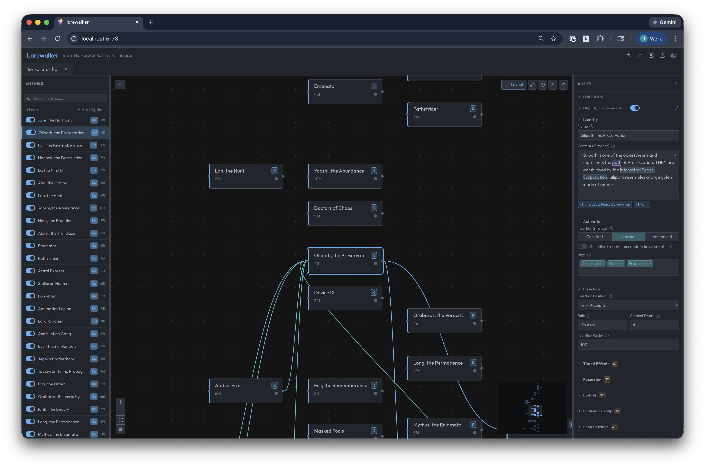
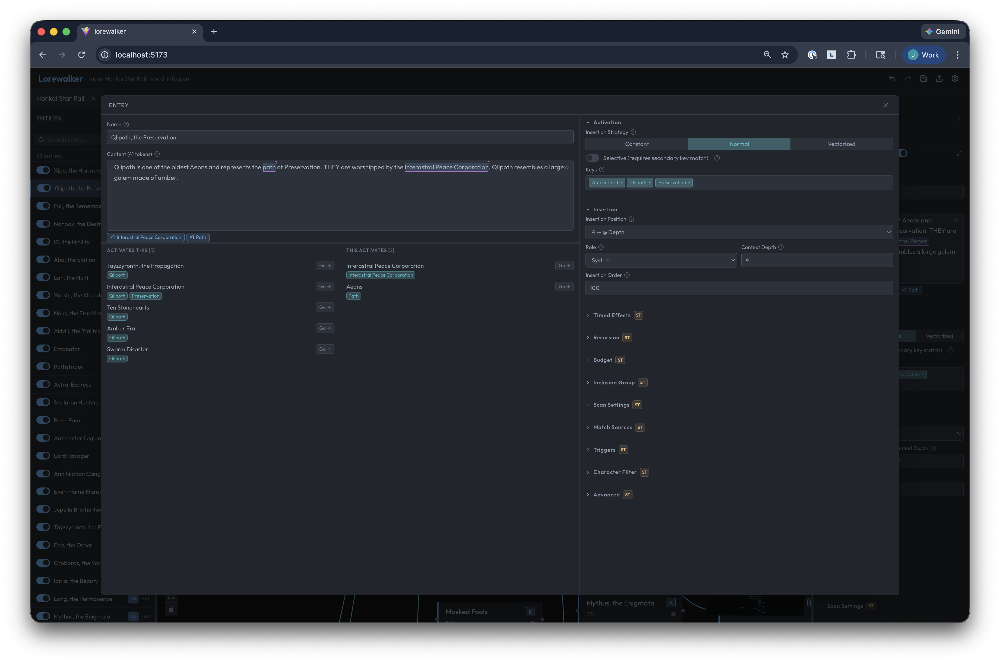

> [!WARNING]
> **This is early alpha software — here be dragons.**
> Analysis and simulation features are rough drafts and not yet fully reliable. Open issues when you find problems. Real-world use cases help more than anything.

---

# Lorewalker

Lorewalker is a local-first lorebook editor, visualizer, and analysis tool for AI roleplay platforms like SillyTavern. It transforms flat JSON lorebook files into an interactive graph-based editing experience — letting you see how your entries connect, catch structural problems, and simulate activation, all without any backend or account.

---





## What's Working Now (Phases 0–5)

- **Import / Export** — drag-and-drop or file picker; full SillyTavern lorebook JSON round-trip
- **Entry editor** — all CCv3 lorebook entry fields with live token counting
- **Multi-tab workspace** — open multiple lorebooks at once, each with independent undo/redo
- **Recursion graph** — interactive node graph visualizing keyword-triggered entry chains
  - Solid edges = active links; dashed = blocked (`preventRecursion` / `excludeRecursion`); red = cycle
  - Auto-layout (dagre), minimap, zoom, fit-to-view
  - Bidirectional selection: click a node to highlight the entry in the list, and vice versa
  - Double-click a node to jump straight to editing that entry
- **Theme system** — 14+ themes including Catppuccin variants, Nord, One Dark, Dracula, Rosé Pine, Tokyo Night, and light variants
- **Deterministic health analysis** *(rough draft, not yet reliable)* — 28 rules across structure, config, keywords, recursion, and budget categories; real-time scoring 0–100 with error/warning/suggestion severities; AnalysisPanel, FindingItem, InspectorPanel
- **Activation simulator** *(rough draft, not yet reliable)* — SillyTavern engine, multi-message conversation replay, step-by-step recursion trace, sticky/cooldown/probability effects; SimulatorPanel, ActivationResults, RecursionTrace
- **Autosave & crash recovery** — IndexedDB-backed autosave (2s debounce), workspace persistence, RecoveryDialog on relaunch, tab-close dirty confirmation, stale doc cleanup

---

## What's Coming (Phases 6–8)

| Phase | Feature |
|-------|---------|
| 6 | **LLM-powered deep analysis** — BYOK qualitative review via any OpenAI-compatible endpoint or Anthropic; content quality, keyword suggestions, splitting recommendations |
| 7 | **Graph editing + UX polish** — drag-drop edge creation, keyboard shortcuts, multi-select operations |
| 8 | **Desktop app** — Tauri-based native wrapper with native file dialogs and system keychain for API keys |

---

## Running Locally

```bash
git clone https://github.com/Rukongai/Lorewalker
cd Lorewalker
npm install
npm run dev
```

Then open `http://localhost:5173` in your browser.

> No account, no backend, no network requests. Everything runs in your browser.

---

## Tech Stack

- [React](https://react.dev/) + [TypeScript](https://www.typescriptlang.org/) + [Vite](https://vitejs.dev/)
- [@xyflow/react](https://reactflow.dev/) — graph canvas
- [Zustand](https://zustand-demo.pmnd.rs/) + [immer](https://immerjs.github.io/immer/) + [zundo](https://github.com/charkour/zundo) — state and undo/redo
- [Tailwind CSS](https://tailwindcss.com/) + [shadcn/ui](https://ui.shadcn.com/)
- [@character-foundry/character-foundry](https://github.com/character-foundry/character-foundry) — lorebook format parsing

---

## Contributing / Issues

Found a bug? Have a use case that doesn't work? [Open an issue](https://github.com/Rukongai/Lorewalker/issues). Real-world use cases are genuinely the most helpful thing at this stage — they shape which features get prioritized.

---

## Support

[](https://ko-fi.com/rukongai)

If Lorewalker saves you time or sanity, consider buying me a coffee. It's entirely optional but very appreciated.
